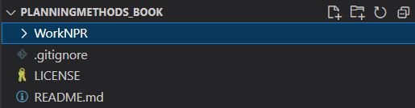

Work Log for Nathanael Rosenheim 
===============================
# Project Overview
Create jupyter book for Planning Methods course
===============================
## Work Log - Notes in reverse chronological order

## October 14, 2022 - Interesting resource for using Bokeh
The Jupyter Book style in mybinder is a great idea
https://github.com/bokeh/bokeh-notebooks/tree/main

## September 15, 2022 - required files setup next...

Setup environment for jupyter book:
- https://jupyterbook.org/en/stable/start/overview.html

```
conda install -c conda-forge jupyter-book
```

I think I have most of the template files setup. 
- https://jupyterbook.org/en/stable/start/create.html

Need to see how to publish to github pages.
- https://jupyterbook.org/en/stable/start/publish.html


## September 15, 2022 - Add Jupyter Book Files

Files copied from 

>22dylan. (2022). 22dylan/pyincore_seaside_jb: Seaside Jupyter book with demonstrative notebooks (v1.0). Zenodo. https://doi.org/10.5281/zenodo.6998352

Edited 
- https://github.com/22dylan/pyincore_seaside_jb/blob/main/_config.yml
- https://github.com/22dylan/pyincore_seaside_jb/blob/main/_toc.yml
- https://github.com/22dylan/pyincore_seaside_jb/blob/main/references.bib
- https://raw.githubusercontent.com/22dylan/pyincore_seaside_jb/main/intro.md
- https://github.com/22dylan/pyincore_seaside_jb/blob/main/requirements.txt
- https://raw.githubusercontent.com/22dylan/pyincore_seaside_jb/main/ref/ref.md

## September 15, 2022 - Inspiring email from Cooper
Have you heard of Jupyter Book? I think you'd love it!

[Creating an open-source book with Jupyter Book and Jupytext](https://youtu.be/jUdXs4OPR84) - This video is a comprehensive introduction/guide. I linked to the timestamp where he goes over the topic of auto referencing figures and citations.

[Jupyter Book overview](https://youtu.be/seKOq-VMJgY) -  This video is a more high-level overview powerpoint style.

It's also cool how you can easily host the Jupyter Book on github-pages. I have to check it out.


## September 15, 2022 - Start Project

Starting project to build my first jupyter book

Setting up work folders and work log.



## September 15, 2022 - Setup Project In Github and Launch into Visual Studio Code

Need to have a Github account and create a new repository.
I selected to start a new repository with a README.md file, gitnore for VS Code, and license Mozilla Public License 2.0 (not sure about the license yet, but this is what NCSA uses for pyincore: https://github.com/IN-CORE/pyincore/blob/develop/LICENSE).


Need to have GitHub for Desktop and Visual Studio Code installed on my computer.
To install these programs, I went to the following links:

- https://code.visualstudio.com/
- https://desktop.github.com/ 


Once the repository is created it can be launched into GitHub Desktop and then into Visual Studio Code.

These screenshots show the process:
 

 

I made sure I saved the repository in a folder on my computer that I could easily find.
 

 

Once in GitHub for Desktop I can open the repository in VS Code.
 

Need to accept and trust the repository.
 

### NOTE on how to drop images into markdown files
https://stackoverflow.com/questions/42961712/how-to-include-image-as-markdown-in-visual-studio-code

I make screenshots using the snipping tool or the print screen button.

I then edit the image (crop, resize, etc.) then save it to the folder I made in my work folder called WorkLogNPR_images.

Then I can drag and drop the images into the markdown file, this creates a link to the image in the image folder.
